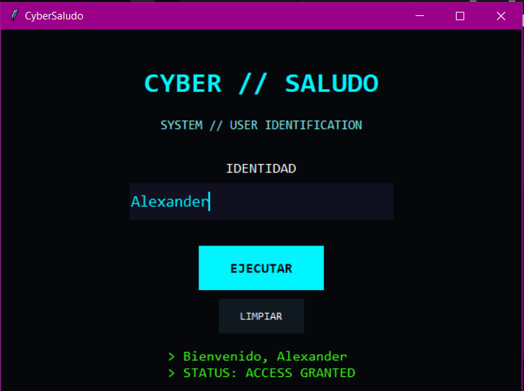

# CyberSaludo

Mi primer programa de escritorio desarrollado en Python.

CyberSaludo permite al usuario introducir su nombre mediante una interfaz gráfica y recibir un mensaje personalizado.

## Captura



## Características

- Interfaz gráfica creada con Tkinter
- Entrada de datos mediante `Entry`
- Validación de campos
- Uso de funciones
- Uso de condicionales
- Eventos mediante botones y teclado
- Botón para limpiar los datos
- Ejecución mediante la tecla Enter
- Diseño visual estilo cyberpunk
- Ejecutable independiente para Windows
- Icono personalizado

## Tecnologías

- Python
- Tkinter
- PyInstaller

## Conceptos aprendidos

Durante este proyecto practiqué:

- `print()`
- variables
- strings
- `input()`
- funciones
- `if` / `else`
- eventos
- interfaz gráfica
- `Label`
- `Entry`
- `Button`
- `.get()`
- `.config()`
- `.bind()`
- `.focus()`
- empaquetado con PyInstaller

## Ejecución desde Python

```powershell
python app.py